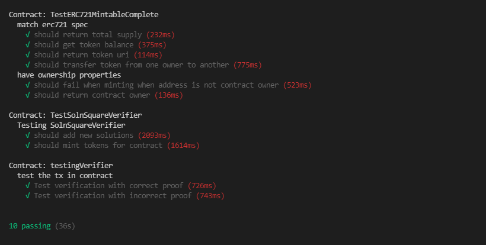

# Udacity Blockchain Capstone

The capstone will build upon the knowledge you have gained in the course in order to build a decentralized housing product. 

# Contract addresses on rinkeby test network

SquareVerifier Contract Address: 0xa3035A9A21b367447649a3105cB5C428a34A2843

SolnSquareVerifier Contract Address: 0x5d6DFCf9bBf35ee55A63851cA8E5F73D2f1a0191

# Opensea StoreFront

Storefront - https://testnets.opensea.io/collection/unidentified-contract-5h0zbrldop

Wallet that bought 5 NFT tokens through the OpenSea storefront: 0x4b1bbA174DF54096Ac04A589E234Dcb4e109023C

# Run Test

`npm i`

install the necessary package

`truffle develop`

run local blockchain on the computer

`truffle compile` 

compile the smart contracts code and see if there is any bug

`test`

type test and click enter to run the test and received result down here

# Project Resources

* [Remix - Solidity IDE](https://remix.ethereum.org/)
* [Visual Studio Code](https://code.visualstudio.com/)
* [Truffle Framework](https://truffleframework.com/)
* [Ganache - One Click Blockchain](https://truffleframework.com/ganache)
* [Open Zeppelin ](https://openzeppelin.org/)
* [Interactive zero knowledge 3-colorability demonstration](http://web.mit.edu/~ezyang/Public/graph/svg.html)
* [Docker](https://docs.docker.com/install/)
* [ZoKrates](https://github.com/Zokrates/ZoKrates)

# ABI Links

[- SolnSquareVerifier.sol](https://github.com/MuhdRaffiq/zk-RealEstate-token/blob/master2/build/contracts/SolnSquareVerifier.json)

[- SquareVerifier.sol](https://github.com/MuhdRaffiq/zk-RealEstate-token/blob/master2/build/contracts/SquareVerifier.json)

# Versions

* Truffle v5.3.6 (core: 5.3.6)
* Solidity - 0.5.1 (solc-js)
* Node v15.11.0
* Web3.js v1.3.5
